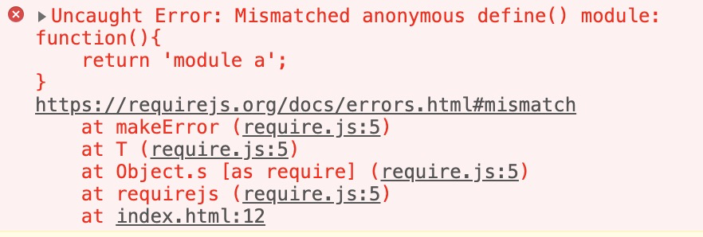

# RequireJs Mismatched 报错总结

文章开始之前需要感谢一下席子同学调试出了在哪种具体情况会报错。

### 常见的一个报错

 在使用requirejs时候经常会遇到这种报错

 上述错误一般发生在 在你页面中同时引入requirejs和其他库文件的时候

###  为什么会发生这个错误？

 requirejs 载入js的时候发生了以下的过程

1. 根据requirejs调用的相对路径生成一个唯一标示，例如："./modulea"
2. 动态创建script标签并插入到浏览器中，实现js文件的下载
3. 下载完成后浏览器会自动执行js文件中的define函数，define函数会将返回的结果放入到一个 队列GlobalDefine中，


这个时候define 函数不知道这个组件的唯一标示是什么，所以他只好把返回的结果放到一个公共的地方等待被知道这个标示的人领走


     4. 动态创建的script 进入onload事件，在这里可以知道组件的ID，在队列中认领出define返回的结果，并给他对应的id；

由于js文件加载和执行是同步的，所以在下一个组件往队列返回结果时，上一个组件返回的结果已经被领走了。

如果在加载完requirejs后，再引入js文件（不是通过执行requirejs的方式）而这个js文件正好也有define函数，按照上述的过程，define执行的结果会加入队列 GlobalDefine中，而这个结果是永远无法被认领的，requirejs 在执行的时候发现一个 没有被认领的 模块，就会报出这样的错误。

### 如何解决？

#### 方案一 ：其他库文件载入前置

 在浏览器载入requirejs文件后不要载入任何包含 deine函的库文件，当然在requirejs载入之前可以。

弊端：不适用于页面加载完成后有些js需要通过动态创建script标签的方式引入，而恰好这个js文件里包含了define\(\)代码；这种场景很少，但是恰好我遇到了

#### 方案二：使用requirejs载入第三方库

 requirejs在载入js时路径有三种不同的写法，完全可以满足我们日常使用的大部分场景；  
关于三种写法的异同可以看我的另外一篇博客  

