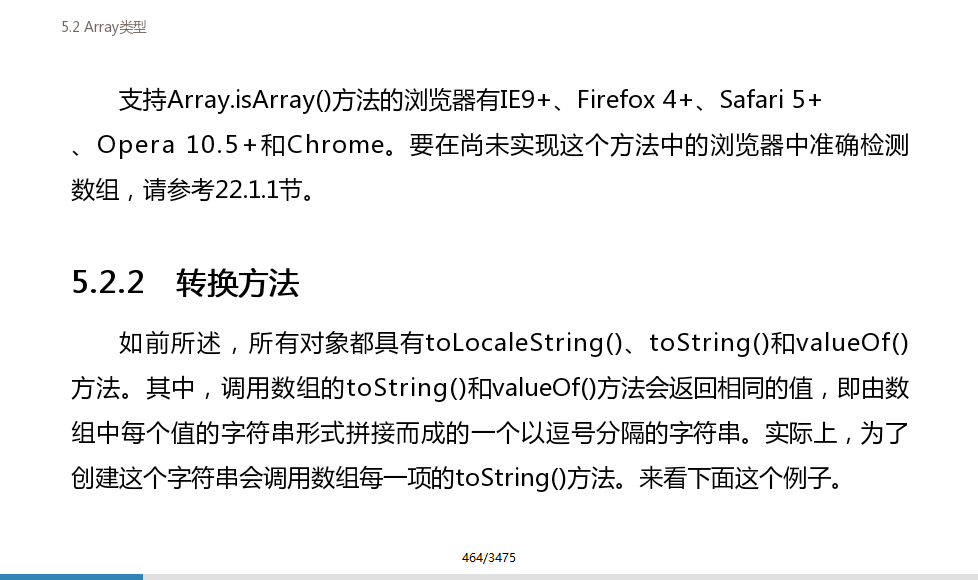

# valueOf,toString和toLocaleString

在JS高级程序里看到这样一段话，Array调用toSting 和 valueOf方法返回相等的值



测试了一下和实际有点出入

在这里valueOf 返回 的是数组而toSting 返回的字符串

  
**valueOf偏向于运算，toString偏向于显示。**  
1、 在进行强转字符串类型时将优先调用toString方法，强转为数字时优先调用valueOf。  
2、 在有运算操作符的情况下，valueOf的优先级高于toString。

  
Array的toString和toLocalString没有什么区别，但是主要体现在其他类型的数据上如

### String类型

```javascript
var a=1234

console.log(a.toString())
//"1234"

console.log(a.toLocaleString())
//"1,234"
```

### Date类型

```javascript
var curData = new Date();
console.log(curData);
//Wed Feb 15 2017 11:21:31 GMT+0800 (CST)

console.log(curData.toLocaleString());
//"2017/2/15 上午11:21:31"

console.log(curData.toString());
//"Wed Feb 15 2017 11:21:31 GMT+0800 (CST)"
            
console.log(curData.valueOf());
//1586741709729
```

